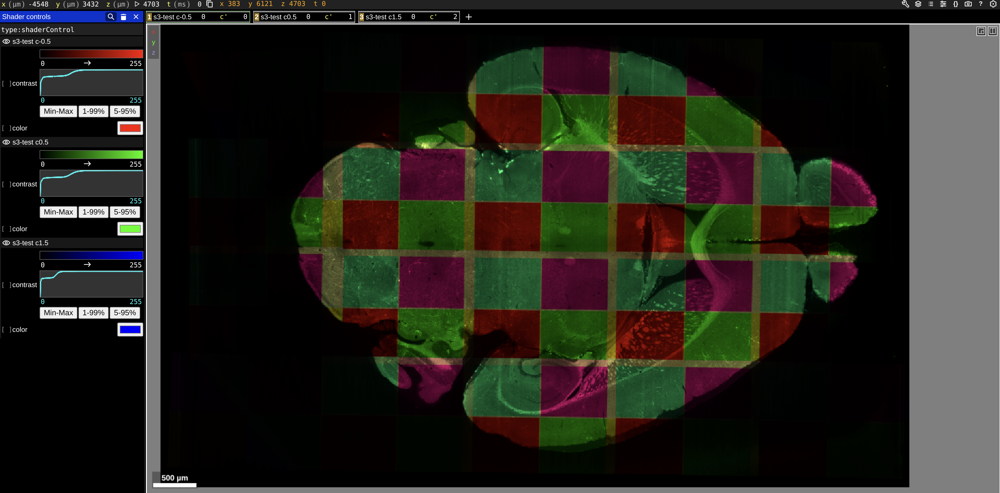

# aind-bigstitcher-qc

Tools to generate ARGB composite overlays from BigStitcher datasets and write them as multi-chanel, multi-scale OME‑Zarr, plus Python utilities to pack overlay crops into a 2D mosaic (via updating translation vectors in OME-NGFF metadata) and emit a ready‑to‑share Neuroglancer link.

- Java utilities (shaded JARs):
  - Composite overlaps per pair of views/illumination tiles
  - Single full‑volume composite overlay
  - Supports split-affine XMLs (see https://imagej.net/plugins/bigstitcher/image-splitting)
- Python utilities:
  - Pack per‑crop OME‑Zarrs into a 2D mosaic by adjusting NGFF translations
  - Generate a Neuroglancer URL that visualizes all crops in one RGB layer

## Repository Layout

- `code/bigstitcher-qc/` — Maven module with the Java CLIs
  - Main classes:
    - `code/bigstitcher-qc/src/main/java/org/aind/bigstitcher/qc/FuseCompositeOverlaps.java`
    - `code/bigstitcher-qc/src/main/java/org/aind/bigstitcher/qc/FuseCompositeVolume.java`
- `code/pack_ome_zarr_mosaic.py` — pack multiple `*.ome.zarr` crops into a 2D mosaic
- `code/create_neuroglancer_url.py` — build a Neuroglancer state/URL for all crops

## Build (Java)

Prerequisites
- JDK 8 with JavaFX support (the repo’s Dockerfile installs Azul Zulu 8u462 with JavaFX)
- Maven 3.6+

Build
- `mvn -f code/bigstitcher-qc/pom.xml package`

Artifacts (in `code/bigstitcher-qc/target`)
- `bigstitcher-qc-<version>.jar` — main entry: composite overlaps
- `bigstitcher-qc-<version>-fuse-composite.jar` — entry: full‑volume composite overlay

Tip
- These tools benefit from ample heap. Add e.g. `-Xmx64g -Djava.awt.headless=true` to `java` invocations.

## Java CLIs

### Composite Overlaps (per‑pair crops)

Runs pairwise overlap detection (by view or illumination group), fuses the overlapping region into a 3‑channel ARGB overlay, and writes each crop as a multiscale OME‑Zarr.

Command
- `java -Xmx64g -Djava.awt.headless=true -jar code/bigstitcher-qc/target/bigstitcher-qc-<version>.jar XML OUTPUT [options]`

Positional
- `XML` — path to BigStitcher `SpimData2` XML
- `OUTPUT` — output root (local folder or URI) under which per‑crop OME‑Zarrs are written
  - Local: `/path/to/out`
  - S3: `s3://bucket/prefix`

Options
- `--block-size INT` — cubic block size in voxels (default auto‑chosen ≤128)
- `--anisotropy FLOAT` — geometric scaling before fusion (default: 1.0)
- `--downsampling FLOAT` — pre‑fusion downsampling factor (default: 8.0)
- `--display-max FLOAT` — input intensity mapped to 255 before tint (default: 100)
- `--max-downsampling-levels INT` — cap pyramid levels (default: 7)
- `--interpolation 0|1` — 0=nearest, 1=linear (default: 1)

Notes
- If BigStitcher metadata contains illumination groups (e.g., when using the split-affine alignment option), crops are generated for tile‑tile overlaps; otherwise for view‑view pairs.
- Output is 5D OME‑Zarr with shape `[X,Y,Z,3,1]` (RGB as 3 channels).
- Each crop keeps its original world coordinates via NGFF translation metadata, so you can run `code/create_neuroglancer_url.py` directly on the raw outputs to visualize the overlaps in their registered positions.

### Composite Volume (single full‑volume overlay)

Fuses all registered sources into one downsampled ARGB volume and writes a single multiscale OME‑Zarr.

Command
- `java -Xmx64g -Djava.awt.headless=true -jar code/bigstitcher-qc/target/bigstitcher-qc-<version>-fuse-composite.jar XML OUTPUT [options]`

Positional
- `XML` — path to BigStitcher `SpimData2` XML
- `OUTPUT` — container location (local dir or URI). For S3, use `s3://bucket/prefix/volume-overlay.ome.zarr`

Options (in addition to the ones above)
- `--dataset-name NAME` — name in NGFF metadata (default: `volume-overlay`)
- `--color-mode view|illumination` — palette by view id or illumination id. This is only useful for the split-affine xml case since coloring by illumination focuses visualization on the alignment of the original full tiles, ignoring the split alignment results. (default: `illumination`)

### S3 Output

- Use an `s3://bucket/prefix/...` OUTPUT to write directly to S3.
- Region: set `AWS_REGION` or `AWS_DEFAULT_REGION`.
- Credentials: standard AWS mechanisms (env vars, IAM role, or `~/.aws/credentials`).

## Python Utilities

Install
- `pip install numpy zarr rectpack`

### Pack OME‑Zarr Crops into a Mosaic

Scans a root folder for `*.ome.zarr`, optionally trims them to a common Z depth, computes a 2D layout, and updates each crop’s NGFF translation so they form a mosaic.

Command
- `python code/pack_ome_zarr_mosaic.py --root ROOT [--padding 20] [--trim-z] [--manifest PATH]`

Key flags
- `--root` — directory containing many `*.ome.zarr` crops
- `--padding` — separation between crops in physical units (default: 0)
- `--trim-z` — trim all to minimal common Z
- `--manifest` — write a JSON summary of final translations

### Generate a Neuroglancer URL

Creates a Neuroglancer state referencing all `*.ome.zarr` crops in one RGB image layer and prints a shareable URL.

Command
- `python code/create_neuroglancer_url.py --root ROOT [--viewer URL] [--layer-name NAME] [--url-template TEMPLATE] [--path-prefix PREFIX] [--shader-file FILE] [--output PATH]`

Key flags
- `--root` — directory with the `*.ome.zarr` crops to visualize
- `--path-prefix` — replace the local filesystem root with a public prefix
  - Example: `https://my-host.example.com/data` or `https://my-bucket.s3.us-east-1.amazonaws.com/data`
- `--url-template` — defaults to `zarr://{data_path}`
- `--output` — optional file to write the URL and state JSON

Shader
- If omitted, a default RGB shader is used that renders the first 3 channels as RGB.

## End‑to‑End Example: Overlaps → Pack → Neuroglancer

Assume
- BigStitcher XML: `/data/stitch/dataset.xml`
- Output root (local): `/results/overlaps`

1) Create composite overlap crops (OME‑Zarr)
- `java -Xmx64g -Djava.awt.headless=true -jar code/bigstitcher-qc/target/bigstitcher-qc-<version>.jar /data/stitch/dataset.xml /results/overlaps --downsampling 8 --anisotropy 1.0 --interpolation 1 --max-downsampling-levels 6 --display-max 100`

2) Pack them into a 2D mosaic (in‑place NGFF translations)
- `python code/pack_ome_zarr_mosaic.py --root /results/overlaps --padding 20 --trim-z --manifest /results/overlaps/mosaic_manifest.json`

3) Generate a Neuroglancer link
- If the mosaic will be served at `https://my-host.example.com/data/overlaps`:
- `python code/create_neuroglancer_url.py --root /results/overlaps --path-prefix https://my-host.example.com/data/overlaps --output /results/overlaps/neuroglancer_url.txt`
- The command prints the URL and writes it to `/results/overlaps/neuroglancer_url.txt` and the state JSON to `/results/overlaps/neuroglancer_url.json`.

## Example: Full‑Volume Composite Overlay to S3

Assume
- BigStitcher XML: `/data/stitch/dataset.xml`
- Target S3 path: `s3://my-bucket/qc/volume-overlay.ome.zarr`

Environment
- `export AWS_REGION=us-west-2`  (or set `AWS_DEFAULT_REGION`)
- Ensure AWS credentials are available (env, IAM, or credentials file)

Command
- `java -Xmx64g -Djava.awt.headless=true -jar code/bigstitcher-qc/target/bigstitcher-qc-<version>-fuse-composite.jar /data/stitch/dataset.xml s3://my-bucket/qc/volume-overlay.ome.zarr --color-mode illumination --downsampling 8 --anisotropy 1.0 --interpolation 1 --max-downsampling-levels 6 --display-max 100 --block-size 64 --dataset-name volume-overlay`

After upload
- You can visualize the single OME‑Zarr directly in Neuroglancer if it’s accessible via HTTPS. As an alternative, place the container under a directory and use `create_neuroglancer_url.py --root <parent>` with `--path-prefix` pointing at the public base URL.

## Troubleshooting

- Out‑of‑memory: increase heap (`-Xmx`)
